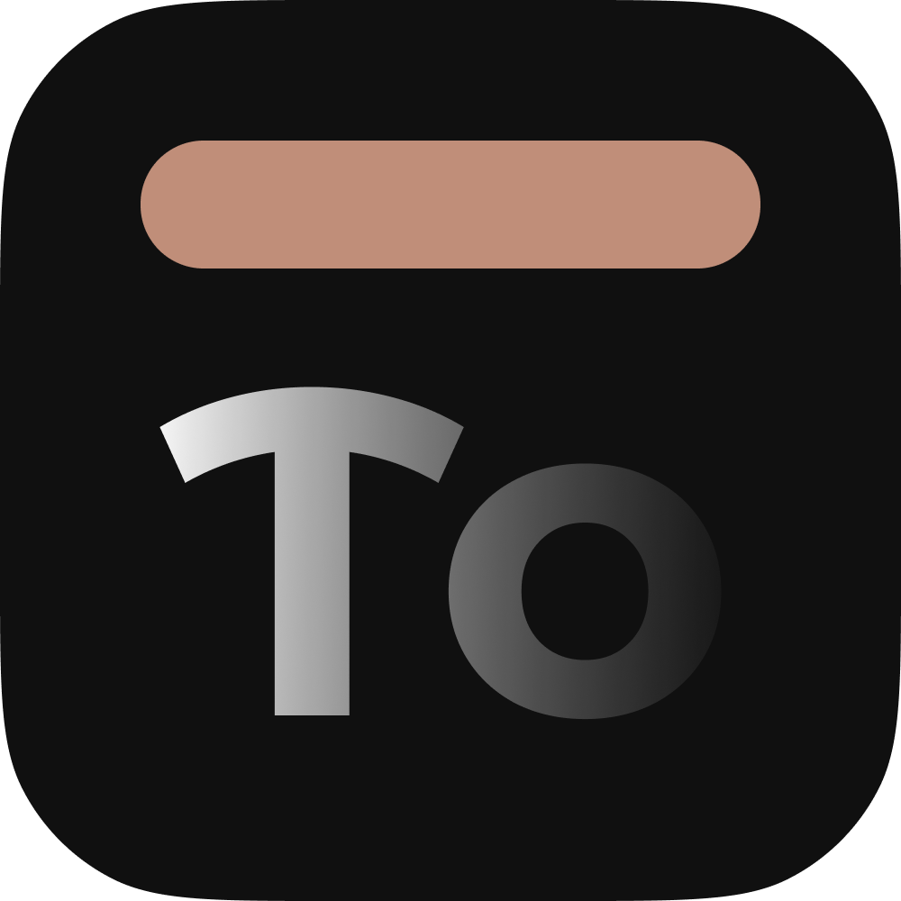

<div align="center">
  <kbd>⚠️ The utility is under development and may contain errors. ⚠️</kbd>
  <br>
  
  <kbd>🦀 Rust</kbd>
  <kbd>🪶 GTK4</kbd>
  <kbd>📂 Open-Source</kbd>
  <kbd>❄️ Hyprland</kbd>

  <br>
  <br><h1 align="center">&nbsp;&nbsp;&nbsp;&nbsp; $\Huge{\textsf{ToTray}}$ <sup><sup><kbd>v.0.1</kbd></sup></sup> 
  <br></h1>
  <p><b>An automated application manager and tray utility for Hyprland.</b></p>
  
  **[<kbd> <br> Installation <br> </kbd>][Installation]** 
  **[<kbd> <br> Build <br> </kbd>][Build]** 
  **[<kbd> <br> Usage <br> </kbd>][Usage]** 
  **[<kbd> <br> CLI (limited) <br> </kbd>][CLI]** 

  <h2></h2>
  
</div>


## ✨ Key Features

- **🚀 Auto-Start Manager**: Manage and delay application startup to ensure a smooth desktop experience.
- **📥 Hide to Tray**: Minimize any application to a ToTray tray icon, keeping your workspace clean.
- **🪟 Workspace Rules**: Automatically move specific applications to designated workspaces on launch.
- **🛠️ Flexible Actions**: Support for `Close`, `Close2` (double-close for apps with splash screens like discord), `Workspace`, and `HideToTray`.
- **🖥️ GUI**: Configure everything through a modern GTK4 interface.
- **🎛️ CLI**: Add rules via command line. `totray --help`
- **🔔 Notifications**: Optional desktop notifications for background actions.
- **📉 Low Overhead**: Written in Rust for maximum performance and minimal resource usage.

<br>

## <a name="installation"></a> 📥 Installation

### 📦 Binary Packages
- **AppImage**: Download the latest version from the [Releases][Download] page. (run `chmod +x ToTray-v0.1.0.AppImage` and then `./ToTray-v0.1.0.AppImage` and see [Usage](#usage))
- **AUR**: Coming soon!

### 🛠️ Manual Installation
If you prefer to build from source, follow the instructions in the [Build](#build) section.

<br>

## <a name="usage"></a> 🚀 Usage

### Starting ToTray
To launch the settings GUI:
```bash
./totray
```
Inside the GUI, click the **"Install Desktop File"** button to register the application and start using ToTray.

### Background Mode
To start ToTray in the background (worker mode, usually used for autostart):
```bash
./totray --worker
```

<br>

## <a name="build"></a> 📦 Build

### Prerequisites
You will need **Rust** and **GTK4** development headers installed on your system.

#### Arch Linux
```bash
sudo pacman -S --needed base-devel gtk4 pkg-config
```

#### Fedora
```bash
sudo dnf install gtk4-devel gcc pkg-config
```

#### Ubuntu/Debian
```bash
sudo apt install build-essential libgtk-4-dev pkg-config
```

### Building from Source
1. Clone the repository:
   ```bash
   git clone https://github.com/Agzes/totray.git
   cd totray
   ```
2. Build the release version:
   ```bash
   cargo build --release
   ```
3. The binary will be available at `target/release/totray`.

<br>

## <a name="cli-management"></a> 🛠️ CLI Management
You can add rules directly from your terminal:
```bash
# Hide Firefox to tray on launch
totray --add --name "firefox" --exec "firefox" --action "tray"

# Move Spotify to workspace 11
totray --add --name "spotify" --exec "spotify" --action "workspace" --workspace 11

# Close vesktop (double close to close splash and main window)
totray --add --name "vesktop" --exec "vesktop" --action "close2"
```

### Available CLI Arguments
- `--worker`: Start only the backend worker (no GUI).
- `--add`: Add a new rule via CLI.
- - `--name <CLASS>`: Window class name (find it via `hyprctl clients`).
- - `--exec <CMD>`: Execution command for the application.
- - `--action <ACTION>`: Action to perform (`close`, `close2`, `workspace`, `tray`).
- - `--workspace <N>`: Target workspace number (required for `workspace` action).
- `--config-json`: Print active rules in JSON format.
- `--version-json`: Print version info in JSON format.

<br>

## ⚙️ How it Works
ToTray monitors window events in Hyprland. When a window matching a defined **Window Class** appears, ToTray executes the assigned action.

- **HideToTray**: Moves the window to a `special` workspace. The tray icon allows you to bring it back to your active workspace.
- **Auto-Start**: Triggers the `exec-once` commands defined in your rules with an optional global delay.

<br>

## 📄 License
Distributed under the MIT License. See `LICENSE` for more information.

---

<kbd>With</kbd> <kbd>❤️</kbd> <kbd>by</kbd> <kbd>Agzes</kbd><br>
<kbd>pls ⭐ project!</kbd>

[Download]: https://github.com/Agzes/totray/releases
[Installation]: #installation
[Build]: #build
[Usage]: #usage
[CLI]: #cli-management
